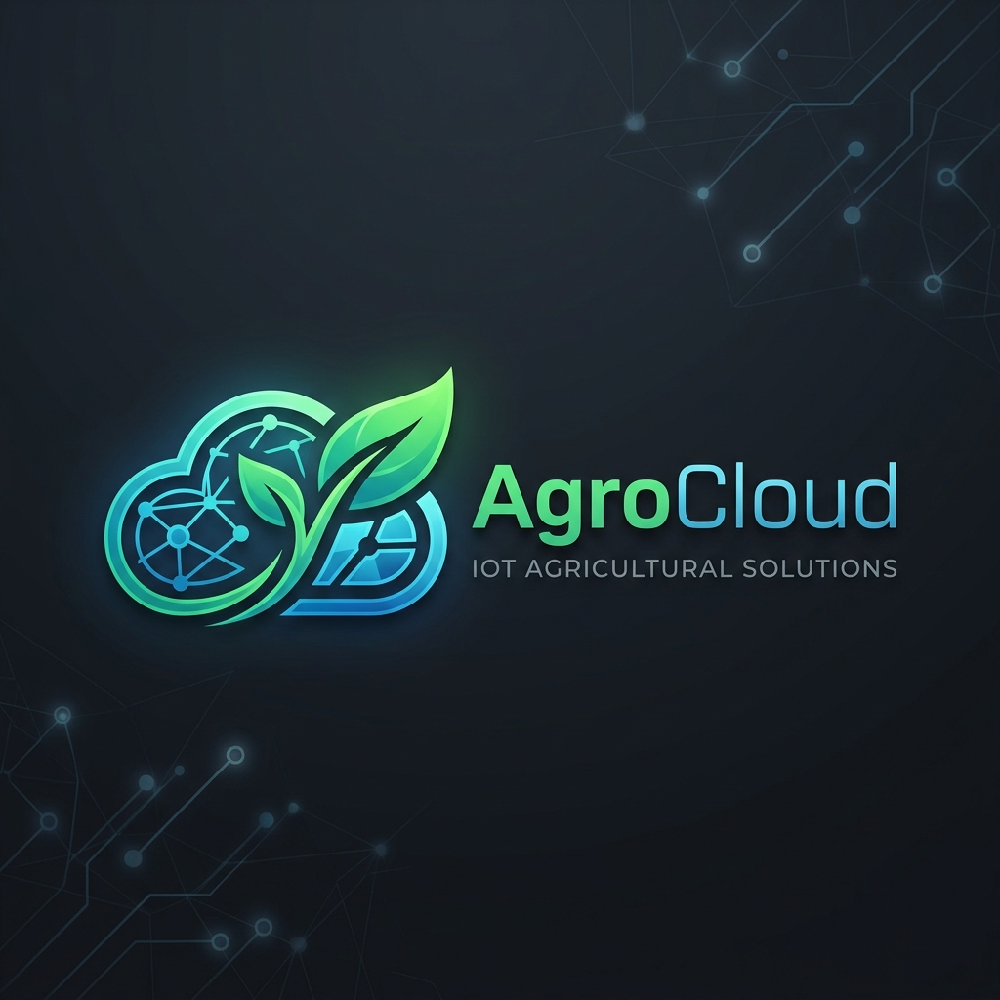
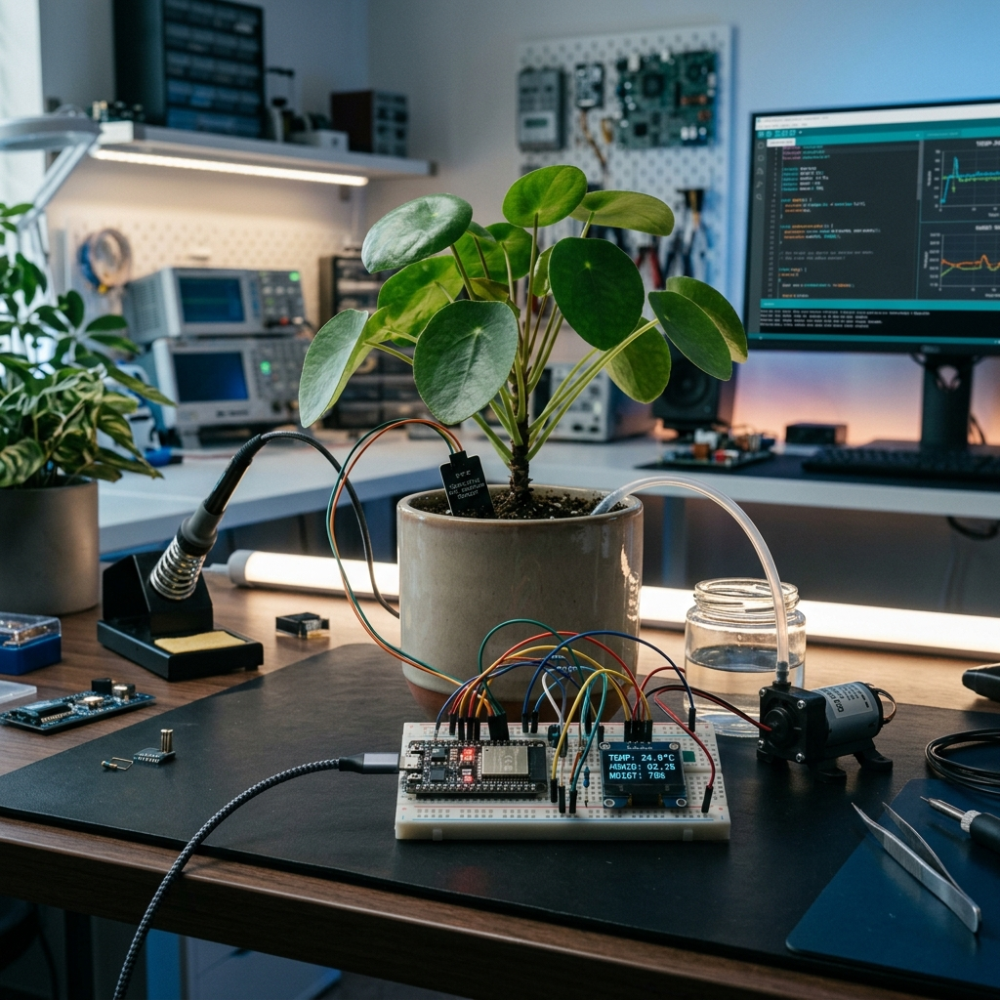

= AgroCloud v2.3 🌿☁️
:Author: pinar_altinok
:Date: 08/05/2026
:Revision: 2.3
:License: MIT

== Intelligent Greenhouse Climate & Irrigation System

AgroCloud is a state-of-the-art IoT solution designed to monitor and manage greenhouse environments. Built with the ESP32 and integrated with Arduino IoT Cloud, it provides real-time data visualization, automated irrigation based on plant-specific presets, and instant environmental alerts.

---

== 🚀 Features

* *Smart Irrigation Logic*: Automated watering using soil moisture sensors with moving average smoothing to prevent false triggers.
* *Plant-Specific Presets*: Built-in profiles for *Cactus*, *Tomato*, and *Orchid*, plus a *Custom* mode for personalized thresholds.
* *OLED Dashboard*: Real-time on-device display showing Temperature, Humidity, Soil Moisture, Pump Status, and Connection quality.
* *Cloud Connectivity*: Full integration with Arduino IoT Cloud for remote monitoring and control from anywhere in the world.
* *Environmental Alarms*: Automated push notifications for critical temperature or humidity levels.
* *Hardware Protection*: Pump protection logic with minimum runtime to ensure motor longevity.

---

== 🛠️ Hardware Components

[cols="1,2,1"]
|===
| Component | Purpose | Pin (ESP32)

| *ESP32 DevKit* | Main Controller | -
| *DHT11* | Temperature & Humidity Sensor | GPIO 5
| *Soil Moisture Sensor* | Moisture Monitoring (Analog) | GPIO 34
| *Relay Module* | Water Pump Control | GPIO 26
| *SSD1306 OLED* | 128x64 Dashboard Display | I2C (SDA/SCL)
|===

---

== 💻 Software Stack

* *Framework*: Arduino Core for ESP32
* *IoT Platform*: Arduino IoT Cloud
* *Libraries*:
** `DHT.h` (Adafruit)
** `Adafruit_SSD1306.h` & `Adafruit_GFX.h`
** `ArduinoIoTCloud` & `Arduino_ConnectionHandler`

---

== 📊 System Architecture

AgroCloud operates on a non-blocking loop, ensuring high responsiveness for both sensor reading and cloud synchronization.

=== Irrigation Control Logic
The system uses a hysteresis-based control loop:

1. *Low Moisture*: Triggers the pump until the target threshold is reached.
2. *Safety Check*: If the temperature exceeds the `dangerTempC` for a profile, the system can trigger cooling/watering logic.
3. *Manual Override*: Toggle between *AUTO* and *MANUAL* modes via the Cloud Dashboard.

=== Plant Profiles

[cols="1,1,1,1"]
|===
| Profile | Moisture Target | Stress Temp | Danger Temp

| *Cactus* | 15% | 45°C | 50°C
| *Tomato* | 60% | 28°C | 33°C
| *Orchid* | 65% | 25°C | 30°C
| *Custom* | User Defined | 30°C | 35°C
|===

---

== 🔧 Installation & Setup

1. *Clone the Repository*:
+
[source,bash]
----
git clone https://github.com/pinaraltinok/AgroCloud.git
----

2. *Configuration*:
* Open `arduino_secrets.h` and enter your WiFi credentials and Arduino IoT Cloud Secret Key.
* Set up your "Thing" on link:https://create.arduino.cc/iot/things[Arduino IoT Cloud] with the properties defined in `thingProperties.h`.

3. *Wiring*:
* Connect sensors and actuators according to the Hardware Table.

4. *Upload*:
* Use Arduino IDE or Arduino CLI to upload the code to your ESP32.

---

== 📝 License

This project is open-source and available under the MIT License.

Developed with ❤️ by link:https://github.com/pinaraltinok[Pinar Altinok]
